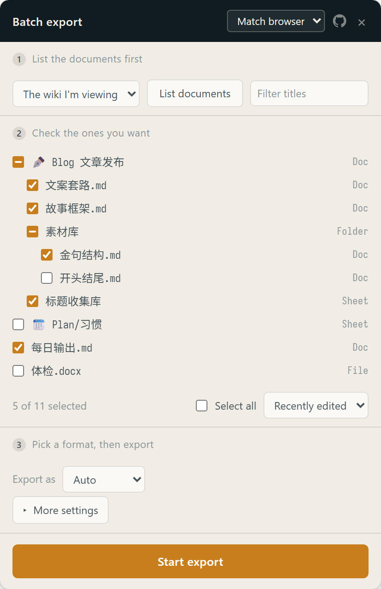

# Feishu / Lark Batch Export

> Feishu exports one document at a time. This Chrome extension lets you check off a batch and get a single zip.

[](LICENSE) [](https://chromewebstore.google.com/detail/lomkhccnocgfifghblhfidifhnilcgdi) [](https://github.com/rockbenben/365opensource)

[⬇ Install from the Chrome Web Store](https://chromewebstore.google.com/detail/lomkhccnocgfifghblhfidifhnilcgdi) · [简体中文](README.md)



Works on **wikis** and **drive** documents, on Feishu and Lark alike. Exports Markdown, Word or PDF; more than one file is packed automatically, with the folder structure preserved.

**Images are saved alongside** — not a nicety: in Feishu's exported Markdown, images are signed URLs that **expire in about 24 hours**. Leave them and your backup is text-only within days.

Once installed, click the small button in the bottom-right corner of any Feishu page and follow 1 → 2 → 3.

<br clear="right">

## Install

[Install from the Chrome Web Store](https://chromewebstore.google.com/detail/lomkhccnocgfifghblhfidifhnilcgdi) and click **Add to Chrome**. **Reload any Feishu tab you already had open** — the extension is not injected into pages that were loaded before it was installed.

The UI follows your browser language (Chinese and English are included); you can also switch it in the top-right of the panel.

Matches `*.feishu.cn` and `*.larksuite.com`, including region subdomains like `xxx.jp.larksuite.com`. Both were tested against live accounts: same API paths, same type matrix, same image-fetch rules. Self-hosted domains (`*.larkoffice.com` and friends) are untested — add one line to `matches` and `host_permissions` in `manifest.json`, no code change, then load it the way below.

### Load unpacked (developer mode)

For reading the code first, editing those two domain lines, or when the store isn't an option. [Download the zip](https://github.com/rockbenben/feishu-lark-batch-export/releases/latest) and unzip it (GitHub Actions packages it on every tag), or clone this repo. Then:

1. Open `chrome://extensions` and turn on **Developer mode** (top right).
2. Click **Load unpacked** and pick the folder that holds `manifest.json` — the one the zip unpacked to, or **`extension/`** if you cloned.
3. Open any Feishu page. A **Batch export** button appears in the bottom-right corner.

## Usage

The corner button is **draggable** and remembers where you put it — that corner is where Feishu keeps its own floating controls, so if it covers something, drag it away. The toolbar icon opens and closes the panel too.

**1 List the documents first**

Pick a source and hit **List documents**. The source follows the page you're on:

- **The wiki I'm viewing** — climbs from the open document to the space root and pulls the whole tree. Needs a `/wiki/xxx` page.
- **My drive** — everything that isn't in a wiki. Works on any page.

**2 Check the ones you want**

Checking a folder checks **everything under it**. **Alt-click** affects only that row — so "just the folder's own page" and "drop the folder, keep the children I picked" are each one click, with no mode to switch into first.

A dash in the box means: that row isn't selected, but something under it is. A checked box always means exactly "this one gets exported"; the dash is a hint and never exports anything.

Types that can't be exported (mindnotes) are disabled outright — you're never allowed to pick something that would only be skipped later.

**Recently edited** checks everything touched in the last 7 / 30 / 90 days, which is what you want for incremental backups.

**3 Pick a format, then export**

**More than one file is packed into a single zip** (`feishu-export-YYYY-MM-DD.zip`); a lone file downloads directly, so Chrome never asks you to allow multiple downloads. Hit **Stop** mid-run and whatever finished still gets packed.

The panel shows progress and a remaining-time estimate based on measured throughput, so a long run isn't a guessing game.

**Start export** stays pinned to the bottom of the panel and the middle section scrolls — on a short laptop screen the primary action is never pushed out of sight.

## Settings

Under **More settings**. The defaults aim at one thing: **mirror the wiki faithfully onto disk.**

| Setting | Default | Why that default |
| --- | --- | --- |
| Save images too | **on** | Image links expire in ~24 hours. Turning this off costs you nothing visible today and every image a few days from now |
| Keep folder structure | **on** | The hierarchy is real information; flattening throws it away, and same-named docs in different folders collide into `(2)` |
| Save comments too | off | Most people want the body text — but discussion threads often hold conclusions that live nowhere else |
| Number filenames | off | Clean `Title.md` wins. Turn it on to preserve the wiki's ordering |
| Prefix parent folder | off | Redundant while folder structure is on. For flat exports that need disambiguating |

Settings are remembered. Numbering **restarts inside each folder** when folder structure is on, so you never get a folder containing `007`, `019` — a flat export falls back to one global sequence.

**Save images too** is independent of the format dropdown: whenever a document's output is `.md`, its images are fetched into `assets/<doc name>/001.png` and the links are rewritten to relative paths — so the Auto format gets images too. docx / pdf / xlsx are binary; the images are already inside the file and there is nothing to rewrite. Images that can't be fetched keep their original link and get a line in the log; the link is never rewritten to something broken.

## What it can export

| Type | Formats |
| --- | --- |
| Doc (new and legacy) | Markdown, Word, PDF |
| Sheet | xlsx |
| Base | xlsx |
| File attachment | downloaded as-is |
| **Mindnote** | **not supported**, see below |

Ask for a format a document can't produce (Markdown for a sheet, say) and it falls back to that type's default rather than failing.

### Why mindnotes aren't supported

Feishu **does** offer a mindnote export — FreeMind (`.mm`), right there in the menu. But **there is no server endpoint behind it.** Three measurements:

1. `/space/api/export/create/` recognises `type=mindnote` but rejects `mm` / `xmind` / `opml` / `txt` (1018, extension mismatch); any other type name returns 1004; standalone paths like `/space/api/mindnote/export/` are all 404.
2. Clicking **Download as → FreeMind** for real fires only a permission check (`guardian/enforce`) and telemetry (`obj_stats/report_operation`, `operate_name: download`) — **no export request at all**.
3. A mindnote page never calls a REST endpoint for its content; the content arrives over the realtime collaboration WebSocket (`pandora_ws/ws_ticket` + `rce/messages`).

So the `.mm` file is **serialised in Feishu's own frontend from the in-memory model** — there is no server-side work to reuse. Supporting it would mean reimplementing Feishu's realtime protocol, which is a different project.

## Notes

- **Serial, never concurrent.** 1.5s between documents. Export is a queued job on Feishu's side; hammering it concurrently invites rate limiting and the time saved isn't worth it.

  > That 1.5s is a conservative guess — Feishu's actual rate limit was never measured. It is a constant in the code rather than a knob for you, because the right fix is to measure the real threshold, not to hand you the decision.
- **Packing costs memory.** Everything is collected before zipping. Content is held as Blobs (which the browser can spill to disk), not in the JS heap, so batches of a few hundred MB are fine — but there is no zip64, so 4 GB / 65535 files will break it. The zip uses STORE, no compression: docx/pdf/xlsx/png are already compressed and squeezing them again just burns CPU.
- A failed document doesn't stop the queue; it gets a line in the log and a **Retry N that failed** button.
- The extension only uses the session already in your browser to call Feishu's own web endpoints. **Nothing is uploaded, there is no server**, and the background script does two things: forward a toolbar click, and hand the panel a locale file. Itemised in [`PRIVACY.md`](PRIVACY.md).
- These are internal endpoints, so a Feishu redesign can break them. They're documented in [`docs/how-it-works.md`](docs/how-it-works.md) with the measured type matrix, so you can diff against reality.

## Why an extension and not a userscript

Since Chrome 138, injecting user scripts needs the separate **userScripts** permission, which is off by default. With it off, Tampermonkey shows the script as installed, matched and running — while **not executing a single line and raising no error**. An MV3 content script is core extension functionality and is unaffected.

## Development

```bash
node --test test.mjs
```

Tests evaluate `extension/content.js` directly, so there is **no build step and no second copy of the logic to drift**. They cover format mapping, filename sanitising and deduplication, tree flattening, space-root discovery, the hand-written zip container, drive-node normalisation, and both locale files (same keys, same placeholder counts, every key referenced by code or manifest exists, no hardcoded Chinese left in the UI, store fields within Chrome's length limits).

The i18n checks were mutation-tested — a key was deleted and a placeholder dropped on purpose to confirm the tests actually go red. Otherwise "all green" might just mean they check nothing.

```
extension/
├── manifest.json
├── content.js          # all the logic
├── background.js       # forwards toolbar clicks, reads locale files
├── panel.css
├── _locales/{zh_CN,en}/messages.json
└── icons/icon-{16,32,48,128}.png
```

This folder **is the release package**: CI zips it whole with nothing excluded, so what you see here is what users install. Design sources (icon, social card) live in `assets/`.

The UI uses Chrome's own `chrome.i18n` rather than a hand-rolled string table, so the extension name, description and store listing are localised too. Adding a language means one more folder under `_locales/`; the test suite will tell you which keys you missed.

### Visual

Icons and the social card are rendered from HTML sources, so a design change means editing the source and re-running one command — no binary assets to maintain by hand:

```bash
for n in 16 32 48 128; do
  node ~/.claude/skills/html-shot/render.mjs assets/icon.source.html \
    extension/icons/icon-$n.png --width $n --height $n --transparent
done
node ~/.claude/skills/html-shot/render.mjs assets/social-card.html assets/social-card.png --palette
```

| Aspect | Value |
| --- | --- |
| Palette | `#101C22` ink · `#1E3440` slate · `#E8A33D` amber · `#C97E1E` deep amber · `#F2EDE4` paper |
| Type | Noto Serif SC for display · Noto Sans SC for body · Sarasa Fixed SC (CJK monospace) for the tree |

**The icon draws the panel itself**: indented rows of checkboxes, the parent outlined and the children filled — which is what this tool actually does (pick part of a tree), rather than a download arrow any downloader could use. Amber is the signal colour throughout: selected, and that 24-hour clock. Feishu's blue is deliberately absent — that's the host app's identity, not this tool's.

In the panel, monospace is used only where alignment carries meaning (the tree, filenames, numbers, the log); CJK monospace is full-width per character and falls apart in prose.

## About the 365 Open Source Plan

Project **#032** of the [365 Open Source Plan](https://github.com/rockbenben/365opensource) — one person + AI, 300+ open-source projects in a year.

[Submit your idea →](https://365.aishort.top/) · [Discord](https://discord.gg/PZTQfJ4GjX) · [Telegram](https://t.me/aishort_top)
