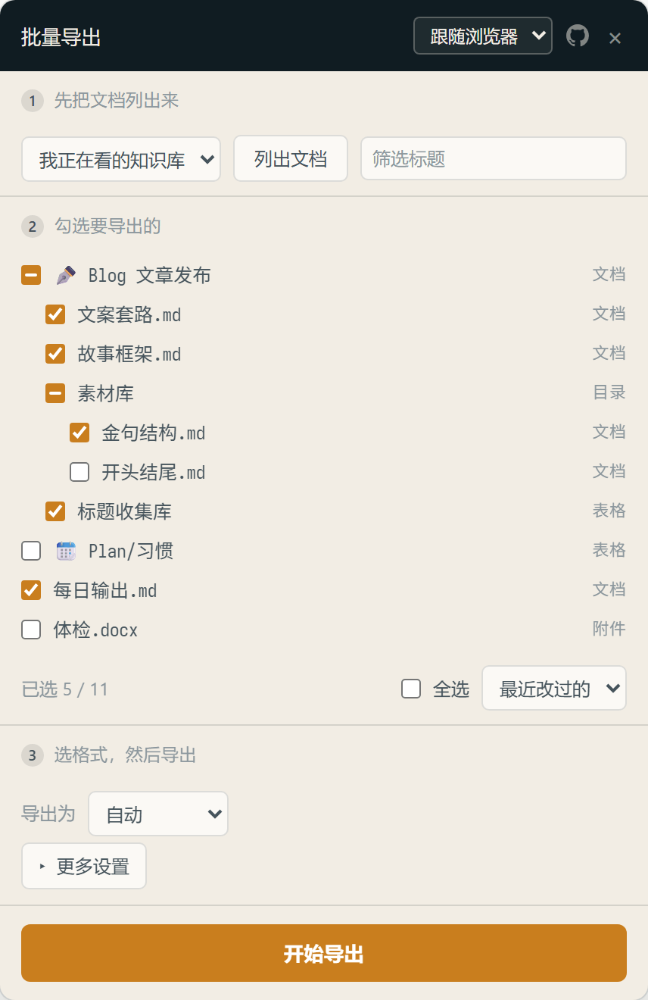

# 飞书 / Lark 文档批量导出

> 飞书的导出只能一篇一篇点。这个 Chrome 扩展让你在树里勾一批，拿一个 zip。

[](LICENSE) [](https://chromewebstore.google.com/detail/lomkhccnocgfifghblhfidifhnilcgdi) [](https://github.com/rockbenben/365opensource)

[⬇ 从 Chrome 应用商店安装](https://chromewebstore.google.com/detail/lomkhccnocgfifghblhfidifhnilcgdi) · [English](README.en.md)



支持**知识库**和**云空间**，飞书和 Lark 都行。导出成 Markdown / Word / PDF，多个文件自动打包，目录结构原样保留。

**图片会一并存到本地** —— 这不是锦上添花：飞书导出的 Markdown 里，图片是一串带签名的链接，**约 24 小时后失效**。不存下来的话，你的备份过几天就只剩文字了。

装完在飞书页面右下角点那个小按钮，面板照着 1 → 2 → 3 走完就行。

<br clear="right">

## 安装

[从 Chrome 应用商店安装](https://chromewebstore.google.com/detail/lomkhccnocgfifghblhfidifhnilcgdi)，点「添加至 Chrome」。**已经开着的飞书标签页要刷新一下**，扩展不会注入到装之前就打开的页面。

界面语言默认跟浏览器走，中英文都有；面板右上角可以手动改。

匹配 `*.feishu.cn` 和 `*.larksuite.com`（含 `xxx.jp.larksuite.com` 这种带区域的子域名）。两边的接口路径、类型矩阵、图片取法都实测一致。私有部署域名（`*.larkoffice.com` 等）没测过，需要的话在 `manifest.json` 的 `matches` 和 `host_permissions` 里各加一条，代码不用动 —— 改完按下面这样装。

### 开发者模式手动安装

想看代码、要改上面那两行域名，或者装不了商店的，走这条。[下载 zip](https://github.com/rockbenben/feishu-lark-batch-export/releases/latest) 解压（打 tag 时由 GitHub Actions 自动打包），或者直接 clone 本仓库。然后：

1. 打开 `chrome://extensions`，右上角开启**开发者模式**。
2. 点**「加载已解压的扩展程序」**，选中放着 `manifest.json` 的那个目录（zip 解压出来的那个文件夹，或 clone 下来的 **`extension/`**）。
3. 打开飞书任意页面，右下角出现「批量导出」按钮。

## 用法

右下角那个小按钮**可以拖动**，位置会记住 —— 右下角本来就是飞书放悬浮控件的地方，挡到什么了就拖开。也可以点浏览器工具栏上的扩展图标开合面板。

**1 先把文档列出来**

选来源，点「列出文档」。来源会跟着当前页面自动切：

- **我正在看的知识库** —— 从你打开的这篇爬到空间根节点，拉出整棵树（需要在 `/wiki/xxx` 页面上）
- **我的云空间** —— 不在知识库里的那些文档，任何页面都能扫

**2 勾选要导出的**

勾目录会**连带勾上它下面的全部文档**。按住 **Alt** 点击则只作用于该条本身 ——「只要目录本身这篇」和「取消目录、保留已勾的子项」都是一次点击，不用先切什么模式。

方框里是一横（半选）表示：这条自己没选中，但它下面有选中的。勾选框的选中状态永远精确等于「这篇会被导出」，半选只是提示，不参与导出。

导不了的类型（思维笔记）直接是禁用的 —— 不让你选一个注定被跳过的东西。

还可以用「最近改过的」一次勾出 7 / 30 / 90 天内改过的，做增量备份。

**3 选格式，然后导出**

**多于一个文件时自动打包成一个 zip**（`飞书导出-YYYY-MM-DD.zip`），只有一个就直接下那个文件。所以不会触发 Chrome 的「允许下载多个文件」弹窗。中途点「停止」，已经导好的部分照样打包给你。

面板里有进度条和按实测均速算的剩余时间，长任务不用干等着猜。

「开始导出」永远钉在面板底部，中段自己滚 —— 小屏笔记本上也不会把主操作挤出视线。

## 设置

在「更多设置」里。默认值围绕一件事：**尽量保真地把知识库镜像到本地**。

| 开关 | 默认 | 为什么是这个默认 |
| --- | --- | --- |
| 一并保存图片 | **开** | 图片链接约 24 小时过期。关掉的代价是隐性的 —— 当场看不出来，几天后才发现图全挂了 |
| 保留目录结构 | **开** | 目录层级是知识库里真实存在的信息，平铺等于主动丢掉它；而且不同目录下的同名文档会撞成 `(2)` |
| 一并保存评论 | 关 | 多数人要的是正文 —— 但讨论区经常有正文没有的结论，备份漏了就真没了 |
| 文件名带序号 | 关 | 干净的 `标题.md` 优先。想保住知识库里的排序再开 |
| 文件名带上级目录 | 关 | 目录结构开着时它是冗余的。只在你要平铺又想消歧时才开 |

设置会记住。**序号是按目录分别计数的**：开着「保留目录结构」时每个文件夹各自从 `001` 开始，不会出现 `007`、`019` 这种跳号；平铺时才退化成全局序号。

**一并保存图片**跟格式选择相互独立：只要某篇最终产出的是 `.md`，就把图片抓到 `assets/<文档名>/001.png` 并把链接改成相对路径。所以选「自动」时照样带图。docx / pdf / xlsx 是二进制，图片已经内嵌在文件里，这个开关对它们无意义。抓不到的图会保留原链接并在日志里记一行，不会把链接改瞎。

## 能导出什么

| 类型 | 格式 |
| --- | --- |
| 文档（新版 / 旧版）| Markdown、Word、PDF |
| 表格 | xlsx |
| 多维表格 | xlsx |
| 附件 | 原文件直接下载 |
| **思维笔记** | **不支持**，见下 |

选了某个格式但当前节点不支持时（比如选 Markdown 遇到表格），会自动退回该类型的默认格式，而不是失败。

### 思维笔记为什么不支持

飞书**给**思维笔记提供导出，格式是 FreeMind（`.mm`），菜单里就有。但**它没有服务端导出接口**。

实测三条证据：

1. `/space/api/export/create/` 认得 `type=mindnote`，却拒绝 `mm` / `xmind` / `opml` / `txt`（1018 扩展名不匹配），换成其它类型名一律 1004；`/space/api/mindnote/export/` 之类的独立路径全是 404。
2. 在页面上真点一次「下载为 → FreeMind」，抓到的只有权限校验（`guardian/enforce`）和埋点（`obj_stats/report_operation`，`operate_name: download`）—— **没有任何导出请求**。
3. 思维笔记页面调过的接口里没有取内容的那一条，内容走的是实时协作的 WebSocket（`pandora_ws/ws_ticket` + `rce/messages`）。

也就是说 `.mm` 是**前端从内存里的文档模型直接序列化出来的**，没有任何服务端的活儿可以复用。要支持它只能复刻飞书的实时协作协议 —— 那是另一个项目的体量。

## 注意

- **串行，不并发。** 每篇之间停 1.5 秒。导出在飞书那边是排队任务，并发打过去容易触发限频，省下的时间不值当。几十篇的量级请预留几分钟。

  > 这个 1.5 秒是拍脑袋定的保守值，没有实测过飞书真实的限频阈值。所以它是代码里的一个常量，而不是给你的旋钮 —— 该做的是去测出真实阈值，而不是把这个决定甩给用户。
- **打包要占内存。** 所有产物先收集再压 zip。内容以 Blob 形式持有（浏览器可落盘），不进 JS 堆，几百 MB 的批次没问题；但不支持 zip64，真到 4GB / 65535 个文件会坏。zip 用 STORE 不压缩 —— docx/pdf/xlsx/png 本来就是压缩格式，再压一遍纯属白费 CPU。
- 单篇失败不中断队列，日志里记一行，跑完可以点「重试失败的 N 篇」。
- 扩展只用你浏览器里已有的登录态调飞书自己的 Web 接口，**不上传任何东西，没有服务端**，后台脚本只做两件事：转发工具栏点击、把语言文件读给面板。逐条说明见 [`PRIVACY.md`](PRIVACY.md)。
- 用的是内部接口，飞书改版有可能失效。接口细节记在 [`docs/how-it-works.md`](docs/how-it-works.md)，含实测的类型矩阵，方便对照修。

## 为什么是扩展，不是用户脚本

Chrome 138 起，扩展注入用户脚本需要单独的 **userScripts** 权限，默认关闭。关着的时候 Tampermonkey 面板里一切正常（脚本装着、匹配着、显示在运行），但**一行都不执行、也不报错**，排查起来毫无线索。MV3 的 content script 是扩展核心功能，不受这个开关影响。

## 开发

```bash
node --test test.mjs
```

测试直接读 `extension/content.js` 源码求值，**没有构建步骤，也不会出现两份实现漂移**。覆盖格式映射、文件名清洗与去重、树扁平化、空间根定位、手写的 zip 容器、云空间节点归一，以及两份语言文件（key 集合一致、占位符个数一致、代码与 manifest 引用的 key 都存在、界面上没有写死的中文、商店字段不超 Chrome 的字符上限）。

i18n 那几条都做过变异验证 —— 故意删 key、去掉占位符，确认测试真的会红。不然「全绿」可能只是它们压根没在检查东西。

```
extension/
├── manifest.json
├── content.js          # 全部逻辑
├── background.js       # 转发工具栏点击 + 代读语言文件
├── panel.css
├── _locales/{zh_CN,en}/messages.json
└── icons/icon-{16,32,48,128}.png
```

这个目录**原样就是发布包**：CI 打包时不排除任何东西，看到什么就是用户装到的什么。设计源文件（图标、社交预览图）都在 `assets/`。

界面语言走 Chrome 原生的 `chrome.i18n`，没有自己搓语言表 —— 这样扩展名、描述、商店列表页也一起本地化了。加一门语言 = 在 `_locales/` 下多一个目录；漏了哪个 key、占位符对不上，测试会告诉你。

### 视觉

图标和社交预览图都是 HTML 源文件渲出来的，改设计就改源文件再重跑一条命令，没有二进制资产需要手工维护：

```bash
for n in 16 32 48 128; do
  node ~/.claude/skills/html-shot/render.mjs assets/icon.source.html \
    extension/icons/icon-$n.png --width $n --height $n --transparent
done
node ~/.claude/skills/html-shot/render.mjs assets/social-card.html assets/social-card.png --palette
```

| 项 | 取值 |
| --- | --- |
| 色板 | `#101C22` 墨 · `#1E3440` 石板 · `#E8A33D` 琥珀 · `#C97E1E` 深琥珀 · `#F2EDE4` 纸 |
| 字体 | 标题 Noto Serif SC（宋体）· 正文 Noto Sans SC · 文件树 Sarasa Fixed SC（CJK 等宽）|

**图标画的是面板自己的样子**：缩进的勾选行，父节点空框、子节点实心 —— 也就是这个工具真正在做的事（在树里挑一部分），而不是一个任何下载器都能用的下载箭头。琥珀是全局的信号色：已选中，以及那个 24 小时的倒计时。刻意没用飞书的蓝 —— 那是宿主应用的身份，不是这个工具的。

面板里等宽只用在对齐真正有意义的地方（树、文件名、数字、日志）；中日韩等宽每字都是全宽，用在散文上会散架。

## 关于 365 开源计划

[365 开源计划](https://github.com/rockbenben/365opensource) 的第 **#032** 个项目——一个人 + AI，一年 300+ 个开源项目。

[提交你的需求 →](https://365.aishort.top/) · [Discord](https://discord.gg/PZTQfJ4GjX) · [Telegram](https://t.me/aishort_top)
